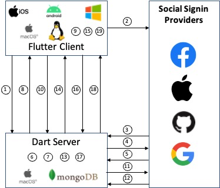

# <b>OAuth2 Demonstrator - Dart Server Component</b>

If you want to get the server up and running now, go to [Setup](#Setup)

This is the server demonstrator, you'll also need the [Flutter client](https://github.com/martin-robert-fink/oauth_client_demo) demonstrator.
## <b>Background</b>

The first step in most client applications is to provide authentication for the end-user.  When I wanted to add authentication with identity providers through their **signin with _provider_**, I ran into the following issues:

- All Flutter plugins were developed for mobile platforms.  There was no support for the Desktop
- Each plugin was different in the implementation
- Most plugins were designed to use the Firebase authentication backend
- Some of the plugins would expose client_id and/or client_secret in client code
- Virtually all online tutorials to help with the signin process assumed the use of the Firebase authentication backend

I therefore decided to implement my own OATH2 authentication client/server from the ground up that would work across mobile and desktop, would not require the Firebase backend, and would support **Signin with _Google_, _Github_, _Facebook_, and _Apple_**.

The end-result is an authentication server written in Dart to act as a demonstrator to help others understand the complete OAuth2 web flow.  It has the the following features:

- Multi-isolate SSL HTTP server
- A WebSocket server to receive CSRF state information from the client
- An message broadcast mechanism to communicate between isolates
- A completer/future function to wait for isolate communication to complete
- A multi-layer HTTP request router for hosts/methods/path
- Generate OpenID Connect id_token (JWT) for Github/Facebook secured with ECDSA keys
- Validate Apple/Google id_token with internet public keys
- Responds to server-to-server token revocation notifications from Apple/Facebook and logs those in a blacklist
- Initiate the refresh token flow when the client requests one
- Maintains authenticated user information in a MongoDB database
- Allows user to authenticate using different providers on different devices/platforms
- Periodic blacklist cleanup for expired tokens
- Generates Apple client_secret using Apple provided private key
- Acts as a basic API server for requests to add/remove/list/count tasks in a MongoDB database
- A unit test suite for most of the application

There is also a Flutter client that is the companion to this server which is responsible for initiating the authentication process.  The client Flutter app is [here](https://github.com/martin-robert-fink/oauth_client_demo).

The Dart server was built and tested on MacOS (Big Sur) on a Mac Mini.  It should build and run on any platform, but hasn't been tried/tested.

**The companion Flutter/Dart applications implement the following flow:**

  

### Flow steps (match step number to image indicators):
1. The client initiates a WebSocket connection to the server and transmits a state value (which is a UUIDv4) to prevent CSRF (Cross-site request forgery).  The Dart server preserves that state value to compare it to the result from the identity provider.
2. The client will open a browser to get an authentication login screen from the chosen identity provider.
3. The identity provider redirects to the Dart server with an authentication code and CSRF state value provided by the client in step 1.
4. After the CSRF state is validated, the server sends the authentication code back to the identity provider in exchange for an access token.
5. The identity provider responds with access token, a refresh token and a token expiration time.  Github/Facebook don't use refresh tokens.  Github access tokens do not expire.  Google and Apple also provide an OpenID Connect JSON Web Token (JWT) as an id_token.
6. The token data is used to extract user profile information and the user is created or updated in the user database
7. An ID Token is generated for Github/Facebook.  An expiration of one day is added to the Github ID token to ensure we check with the Github server that the user is still authenticated.
8. The Access Token, Refresh Token, and ID Token are sent back to the client on the WebSocket connection and the client stores those values locally.
9. Before initating an API call, the client checks if the token has expired.  If the token has expired, a refresh of the token is requested
10. If a refresh token is needed, the client issues a GET request to the server for a new token
11. The server uses the refresh token to request a new token from the identity provider.
12. the identity provider responds with similar data as in step 5
13. The new token data is updated and a new id token is generated as needed. Similar to step 6.
14. The server sends an HTTP response to the GET request initiated in step 10 with the new token data
15. The client updates the stored token information and the API request proceeds as normal
16. The API request (eg get all tasks) is issued as normal sending the id token (not the access token)
17. The server receives the API request and checks the is token valid (there are a number of validity checks, included checking the blacklist)
18. The server responds with the requested task data if the token is valid, or responds with an unauthorized status
19. If the client gets an unauthorized status, immediatly navigates to the login screen for the user to re-authenticate.  If the the status is ok, and the request data is received, then the screen updates with the requested information (the task list)

# Setup

In order to get the server running, you'll need to ensure you have Dart installed and a MongoDB installation running as well.  You'll then need to go through the following setup steps:

1. You'll need your own domain and have SSL keys setup for that domain.  I acquired a domain from Google and use the [Google Domain](https://domains.google) service for the DNS records.  I used [Let's Encrypt](https://letsencrypt.org) for my SSL keys and CA certificates. 
2. Setup an application at each of the providers [Apple](https://developer.okta.com/blog/2019/06/04/what-the-heck-is-sign-in-with-apple), [Google](https://console.cloud.google.com/apis/credentials), [Facebook](https://developers.facebook.com/apps/), [Github](https://github.com/settings/developers).  For each provider you'll need to provide an *authorized redirect URI*, make sure you format it as `https://auth.yourdomain.com/v1/auth/<provider>`, where `provider` is one of `apple`, `google`, `github`, `facebook`.:
     - **Apple**: Read Aaron's article until the point where you download your private key file.  You need to rename the .p8 file you download to `apple_private_key.pem` and locate it in the `<project>/assets/keys` folder.  Also make sure you save your `keyId`, `clientId` and `teamId`.  You'll add them in the next dection.  You'll also fill in the `Server to Server Notification Endpoint` with `https://auth.yourdomain.com/v1/revoke/apple`.
	- **Google**: Setup an OAuth2 client ID.  There are no javascript origins.  Keep a note with your `clientId` and your `clientSecret`.
	- **Facebook**: When you setup your Facebook app, add Facebook login product.  Fill in the `Deauthorize Callback URL` with `https://auth.yourdomain.com/v1/revoke/facebook`. Note your `clientId` and `clientSecret`.
	- **Github**: Create an OAuth2 app.  Write down your `clientId` and download your `clientSecret`.
3. In the folder `<project>/assets/` open the `issuers.json` file.  For each of the providers, fill in the `clientId`, `keyId`, `teamId`, and `clientSecret` fields.  Note that not all providers require all fields.
4. Also in the `issuers.json` file, fill in the `auth_redirect_url` field for each provider.  This field will match what you filled in as the *authorized redirect URI* at each provider in step 2.
5. Generate a private/public key pair that will be used to sign id tokens for Github and Facebook.   
   - The command to generate the private key is: `openssl ecparam -name prime256v1 -genkey -noout -out ecdsa_private_key.pem`.
   - Generate the public key from the private key using: `openssl ec -in ecdsa_private_key.pem -pubout -out ecdsa_public_key.pem`.  
   - Move both key files to the `<project>/assets/keys` folder.  You should end up with 3 files in the folder:  The apple private key, and the private/public key files you just generated.  
   - I recommend you set the ownership for each of the key files to `root` and set the files as `read-only`.
6. Finally, you'll setup a number of constants that are specific to your installation.  All of the constants are located in files in the `<project>/lib/constants` folder.
    - In the `database.dart` file, set the `DB_HOST`, and `DB_PORT` to match your MongoDB installation.  Feel free to pick a different name for the database in `DB_NAME`.
    - In the `hosts.dart` file, set each of the `XXX_HOST` constants to match your domain name.
    - In the `server.dart` file, setup the location of your SSL certificates.  If you did you [Let's Encrypt](https://letsencrypt.org), then `BASE_KEY_PATH` will most likely look something like `/Users/<user>/letsencrypt/config/live`.  `KEY_DOMAIN` will most likely match your `DOMAIN_HOST` constant from the `hosts.dart` file. Set the `CUSTOM_SCHEME` constant to also match your domain.  This will need to match your custom URI that will be setup on the Flutter client.
7. A few changes in the test suite.  In the folder `<project>/test`, look in the file `router_test.dart` and change the `HEADERS_HOST` and the `HOST` constants to matchs your domain.  Also in `socket_server_test.dart` look for `headers: {'host': 'api.YOURDOMAIN.com'}` entry and change it to match your domain.

That should complete the setup and you should be ready to run the server.  A good way to make sure setup is ok, is to just run the test suite and make sure everything passes.  You'll notice that the `<project>/bin` folder has a `run.sh` file.  That's simply a convenience to run the server using `sudo`.  Since all the SSL keys are installed in `root` protected locations, the server needs to run as `root`.  If the server were to run in production, it would be a daemon spawned at server startup also as `root`.  I just open a terminal window in VSCode, and type `bin/run.sh`.  You should get a list of API Servers started (based on the number of hardware threads your system has) and the server is now ready to start processing `auth` and `api` requests from the client.

# How the server runs

The server is setup to spawn one API (and auth) server Isolate for each hardware thread on the system.  Each isolate is listening for api/auth/websocket connections on the `SSL_PORT`.  Any request that comes into the server can attach to any isolate and there's no way to predict which isolate will respond to which request.  If you review the [flow](#Flow) in the background section above, you'll notice that the client initiates the process with a WebSocket connection.  That connection can come into any isolate.  However, the redirect from one of the identity servers could come on a different isolate.  A *message broker* is used to broadcast messages too all of the isolates.  That's the mechanism that is used to match up the isolate that received the Web Socket connection from the client with the redirect that comes in from the identity server.  All of the code related to starting the API server, doing message communications, and responding to web socket connections is in the `<project>/lib/server` folder.

All of the API servers are really Dart `HttpServer` objects listening on the SSL port.  A simple hierarchical router mechanism is used to route the requests to the right place.  The router is architected in such a way that it would be easy to separate the `auth`, `api`, `www`, and even database components into separate servers.  All the request routing functions are in the `<project>/lib/router` folder.  

The main router is the `host_router.dart`.  It parses and sends the inbound request to one of the `api`, `auth`, or `www` routers who in turn route `GET`, `POST`, and `DELETE` requests.  

The `auth` routers are responsible for handling all in the inbound *redirect URI* requests from one of the identity providers.  The provider (called `issuer` in the code) is identified and the right authentication process is used to match the provider.

The `api` routers are used to demonstrate rudementary api requests, but more importantly (in the context of this demonstrator), validate the tokens that come in with each api call and reject them if the tokens are not valid.

The `www` server (not a router) is only used to serve up some basic web pages to indicate if an authentication has succeeded or failed on Linux/Windows (there is no redirect URI on those platforms).  All of the success/fail web pages that are served up are located in the `<project>/assets/html` folder.

The router folder also has a `validate.dart` file which has a static function used to validate the inbound requests.  This is a security feature to make sure only known requests are processed and everything else is rejected.

# Authentication

All the authentication functionality is located in the `<project>/lib/auth` folder.  The primary abstract class is `SocialAuth` located in the `social_auth.dart` file.  Most of the functionality, and all the components that are common to all providers are in this class.  Each of the providers have a unique implementation of the OAuth2 flow and those differences are captured in each of the specialized classes.  By reading through the base class, and the specialized classes, you can understand the complete Oauth2 flow for each of the providers.

# Tokens

Each provider issues one or more of the following tokens:  `access_token`, `refresh_token`, and `id_token`.  Typically, the `access_token` would be provided with each API call, then the `access_token` would be validated with the provider/issuer at each API call.  Apple and Google also provide an `id_token` which allows API calls to be self contained and valided on the API server without making any calls to the provider/issuer.  This demonstrator creates `id_token` for Facebook and Github and only uses `id_token` to validate API calls.  Github `access_token` have no expiration.  As a result, when creating the `id_token` for Github, a one day expiration is used to ensure the token is validated at least once every 24 hours.  Facebook tokens expire in 60 days.  However, Facebook supports server-to-server notifications for token revocation.  This feature is implemented.  That way we don't need to check with Facebook regularly.  Apple also support server-to-server notification and this feature is also implemented.  Google does not support server notification of token revocation, but the tokens are shorted lived enough that they'll need refreshing on a regular basis.

`refresh_token` are implemented differently by each issuer.  Apple and Google implement `refresh_token` how you'd expect and they are used to refresh the `access_token` and `id_token`.  Facebook just uses long-lived `access_token` as `refresh_token`.  The refresh implementation in the `facebook_auth.dart` file takes this into account.  Github `access_token`s don't expire and thus, don't have companion `refresh_token`.  The refresh process simply revalidates the existing `access_token` when it comes to Github.

The `<project>/lib/auth` folder has an `id_token.dart` file which contains a class with static functions to validate an `id_token`, or generate and `id_token`.

# Token revocation and black listing

When Apple/Facebook send a notification that a user has revoked a token, that token's critical information (the user ID, the issuer, and the expiration) is added to a blacklist collection in the database.  If an API call is done using a black listed token, then the API call gets an *unauthorized* response.  In order to make sure the black list collection doesn't grow to infinity, there is a periodic (once/day) cleanup process that cleans up the black list collection in the database for tokens greater than 60 days old.  The cleanup process runs in the main isolate and is initated at the end of the isolate startup process.  See the `<project>/lib/server/api_server.dart` file for details.

# Database functions

There are three document collections in the database: `blacklist` (described above), `users`, and `tasks`.  Whenever a new user is authenticated, a new user entry is added to the `users` document collection.  There is no mechanism to remove users or any associated user data (tasks) from the database at this time.  A user can authenticate using different social providers on different devices.  The user's email address is used as the link point.  Token data is only kept at each client, not on the server.

For demonstration purposes only, a `tasks` collection is used to show how token validation occurs with each API call.  The thought process behind this server is that ONLY valid calls should come in.  The companion Flutter client will ensure that a token has not expired before initiating an API call.  If it's expired, then a refresh request is made before attempting an API call.  In the end, every single API call is checked, but should rarely (if evver) be rejected.  The request/token validation is located in `<project>/lib/router/validate.dart`

# Feedback

I hope you're able to make use of this demonstrator to understand the inner working for a number of OAuth2 providers.  There are many others and it would interesting to see how easy adding a new one would be.  If you have any feedback, comments, suggestions, recommendations on this project, you can reach me at [Martin Fink](mailto:martin.robert.fink@gmail.com).
